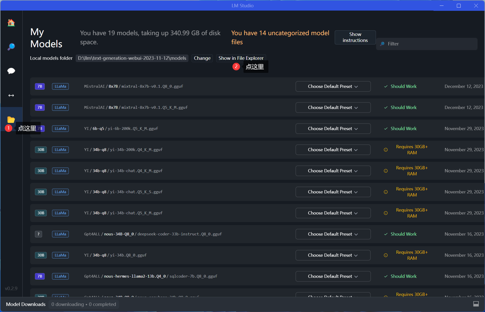
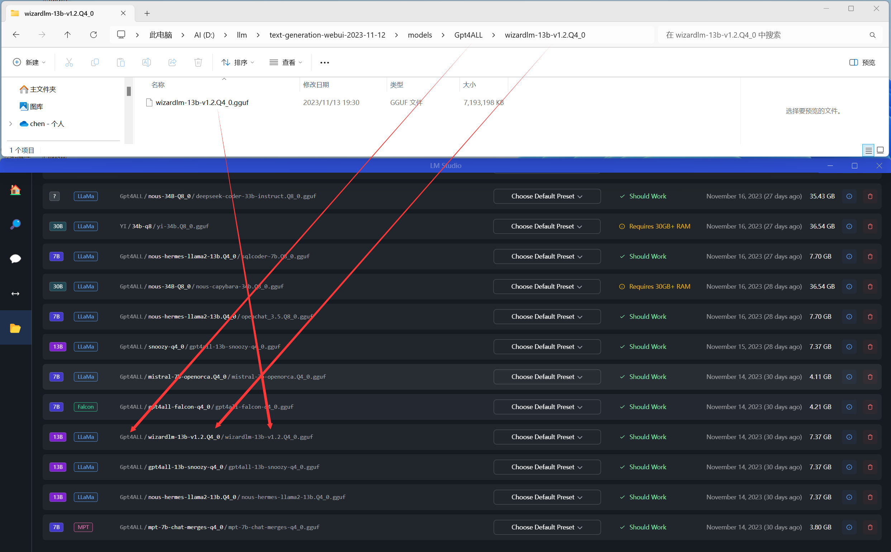
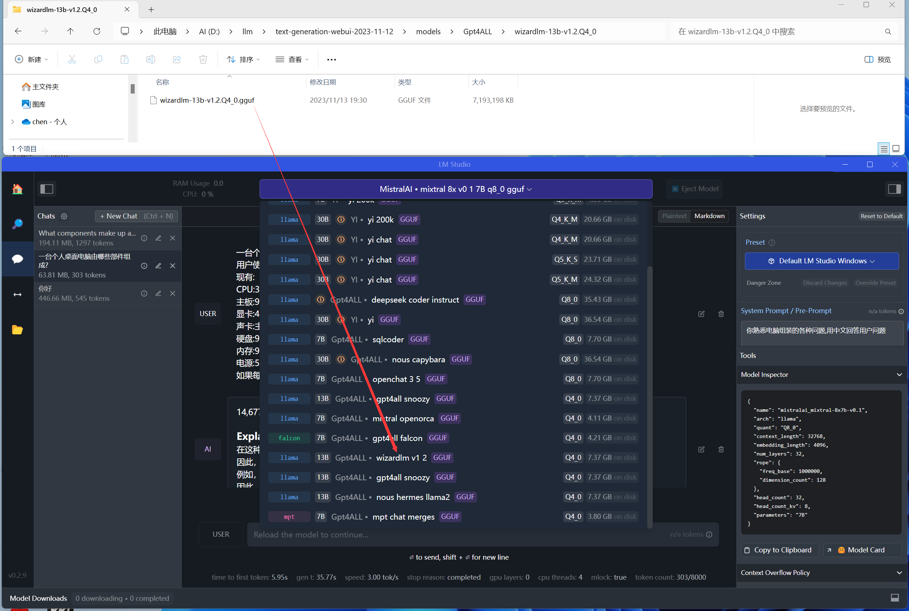
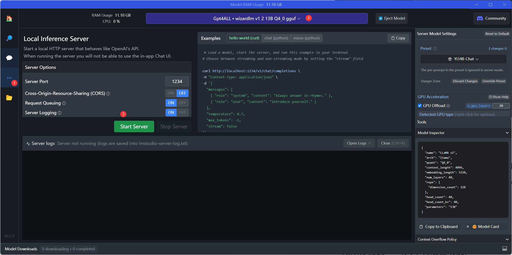
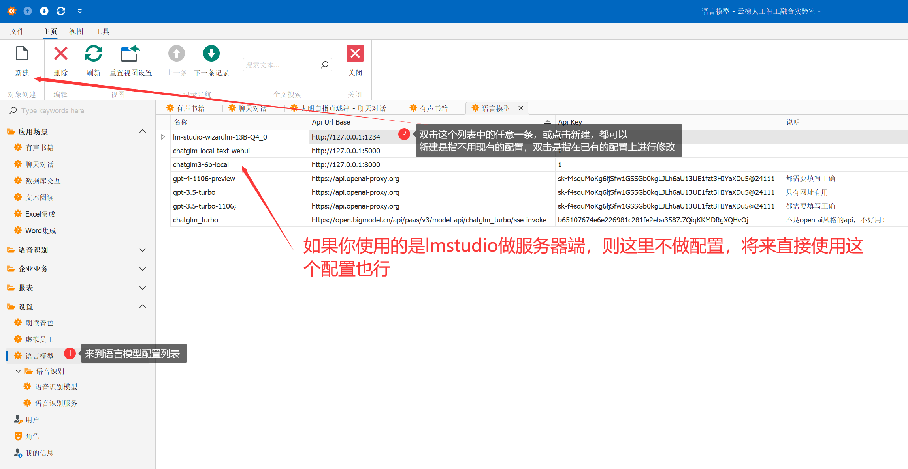
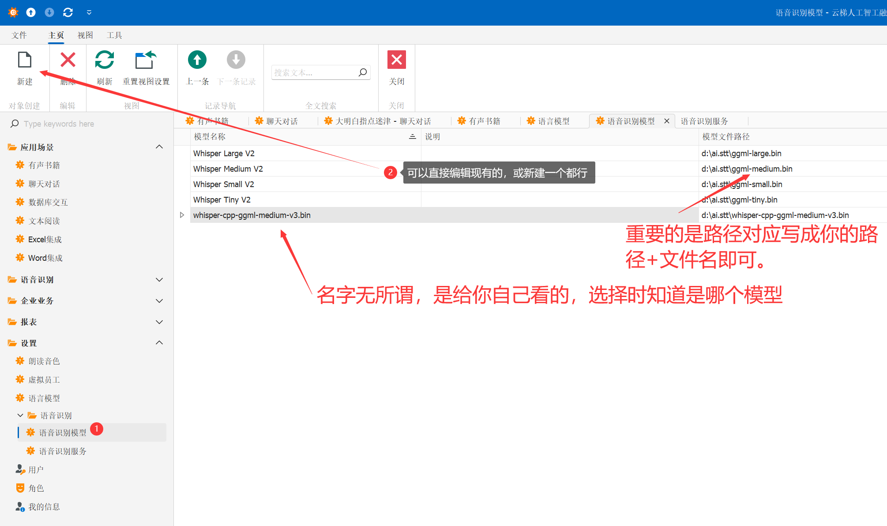
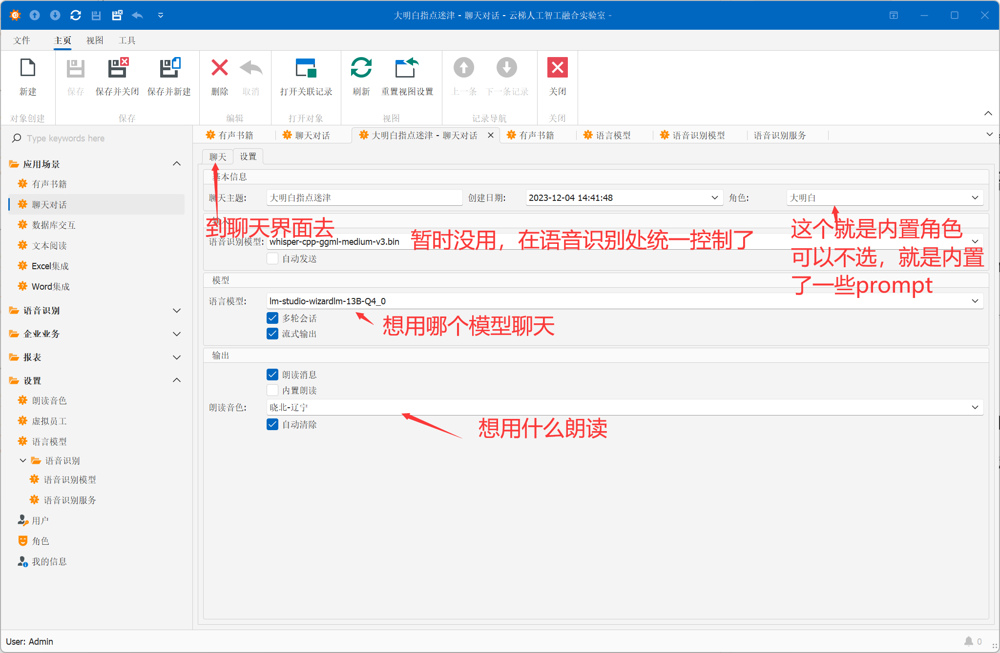

# 如何运行?  

## 1.如果你有任意模型的OpenAI风格的API服务已经在正常运行  
可以在软件中直接使用此API.跳转到第3条。  

## 2.如果你需要在本地部署LLM服务，否则请忽略本条  

如果你想在本地部署自己的LLM服务，那么一个可选项是使用LMStudio.因为它提供了openai风格的API.
AI.Labs中只支持openai风格的API调用。    
下载地址：https://lmstudio.ai/  
然后下载您想要用的模型，只要是GGUF格式的，都可以。  
模型下载：https://huggingface.co/TheBloke 需要魔法  
模型下载：https://hf-mirror.com/TheBloke 免魔法  
模型下载：https://wisemodel.cn/models 免魔法  
模型下载：https://gpt4all.io/ 免魔法  
### 配置LMStudio  
#### 2.1.下图是服务端的模型配置界面，点了1->2所示后：
  
#### 2.2.在弹出的文件浏览器中按下图配置，文件夹名你可以自己取  
  
#### 2.3.配好之后是这样的效果：  
  
#### 2.4.你可以在LLMStudio中测试模型的聊天，然后去启动服务  
按下图操作顺序完成3步操作。  
  

## 3.配置AI.Labs的LLM Server信息  
这一步就是为了让AI.Labs调用LMStuio的API  
### 3.1 打开下载的编译好的文件解压到任意文件夹后，打开AI.Labs.Win.exe即可。
### 3.2 输入用户名 Admin （注意大小写），无密码，进入系统
### 3.3 设置->语言模型,如图所示

  

## 4.如果你需要语音识别功能  

如果你想选择自己要的语音识别模型，这是可以用的列表
https://hf-mirror.com/ggerganov/whisper.cpp/tree/main  

如果你不关心，只想看看效果，你可下载这个：  
https://hf-mirror.com/ggerganov/whisper.cpp/blob/main/ggml-medium.bin
他们的命名方式是不带版本的是最新版，当前是v3.  

下载完成后，可以放到任意目录，但要在AI.Labs中去配置。  
  

**重要：配置完成后，需要到设置->语音识别->语音识别服务 点击上方的“停止”按钮，然后选择刚刚你配好的模型，重启系统**

## 5.如果你需要TTS(文本转语音功能)  

### 5.1 你需要安装python.(略)
### 5.2 你需要安装edge-tts python库.
到命令行下执行：  
$ pip install edge-tts  
If you only want to use the edge-tts and edge-playback commands, it would be better to use pipx:  
$ pipx install edge-tts  
## 6.配置完成可以开始聊天了
### 6.3 左侧菜单中选择 应用场景->聊天对话  
### 6.4 双击任意一个已经存在的对话 或 点击 左上角的 新建 都可以。
假如你点的是第一个,这里是配置的说明：  
  

**---完---写说明好累~~~**
