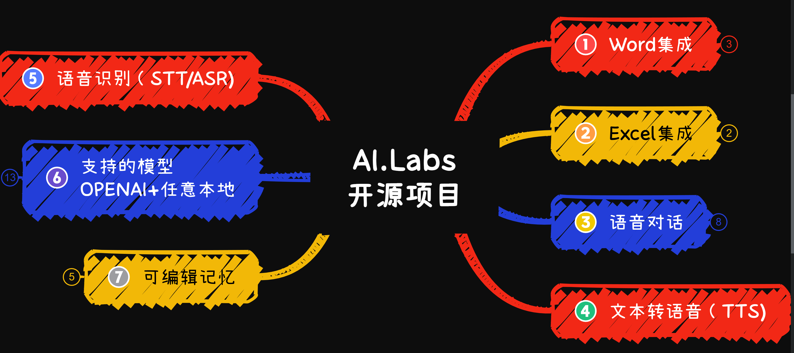
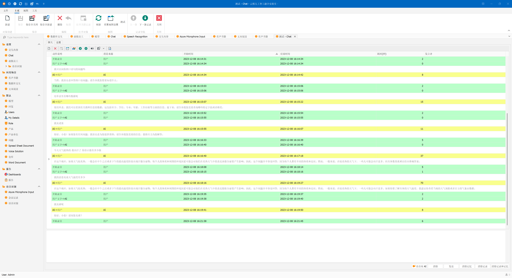

# AI.Labs (Cloud Ladder AI Integration Laboratory)

[中文版](/Readme.cn.md)

AI.Labs is an open-source project that aims to integrate the most advanced artificial intelligence technologies to provide a powerful AI platform. The core of this project lies in the integration of various AI services, including large language models, speech recognition, and speech synthesis, to support functionalities such as dialogue, voice interaction, and meeting transcription.
QQ Group: 306499618
This project includes the following features:
[Bilibili Feature Demonstration Video 1](https://www.bilibili.com/video/BV1jC4y1Y7et/?share_source=copy_web&vd_source=11323d03e28fe3d5d656ff7d4c5662fb) Clicking the triple link will get you the installation package + model
[Bilibili Chat Video Demonstration 2](https://www.bilibili.com/video/BV1hb4y1579q/?share_source=copy_web&vd_source=11323d03e28fe3d5d656ff7d4c5662fb)
[How to Run Documentation](https://github.com/tylike/AI.Labs/blob/master/HowToRun.md)

[Project Repository:](https://github.com/tylike/ai.labs)

Main Features
## 1. Large Language Model Dialogue System
### 1.1 OpenAI API Interface:
The project integrates support for OpenAI's GPT-3.5 and GPT-4, enabling real-time intelligent dialogue through the OpenAI API.
Utilizes the following project: https://github.com/betalgo/openai
### 1.2 Local Language Model Server:
Deploy large language models (LLM) locally using LMStudio or ChatGLM3-6B, interacting with a similar API to OpenAI, ensuring data privacy while improving response speed.
Note: model and model services are not limited; any with OpenAI-style API support can be used.

Download Address: https://lmstudio.ai/
Model Download: https://huggingface.co/TheBloke (VPN required)
Model Download: https://hf-mirror.com/TheBloke (VPN not required)
Model Download: https://wisemodel.cn/models (VPN not required)
Model Download: https://gpt4all.io/ (VPN not required)

# 2. Speech Recognition STT/ASR
## 2.1 Local Speech Recognition:
### 2.1.1 Using whisper.cpp
Implements local speech recognition, reducing dependence on external services and enhancing response speed.

### 2.1.2 Azure Speech Recognition:
Also provides integration with Azure's speech recognition service to leverage its advanced cloud-based speech recognition technology.

## 2.2 STT/ASR Application 1: Meeting Transcription Feature
Using the project's speech recognition capabilities, AI.Labs can carry out real-time recording of meeting content, making information archiving and retrieval more efficient.
Technology Stack
The project utilizes the DevExpress Application Framework, ensuring modernization and high customizability of the user interface.

# 3. Speech-to-Text TTS
## 3.1 EdgeTTS Voice Synthesis:
Uses EdgeTTS for local voice output, free of charge.
Utilizes the python project edge-tts.
Requires local installation of this python program.
Installation guide: https://github.com/rany2/edge-tts
## 3.2 Azure TTS Voice Synthesis
Users can register their own accounts, with 5 hours per month free or 5 million characters.
Supports Azure TTS service, allowing users to opt for cloud-based voice synthesis service.
Registration Address: https://portal.azure.com/

# 5. Integration of Translation and Chat

# 6. DevExpress Application Framework (XAF)
The project uses XAF, website: http://www.devexpress.com
Please purchase the legitimate version of DevExpress for use in real-world environments.
For testing purposes, a one-month trial version can be downloaded.
# 7. Environment
AI.Labs is based on a combination of technologies including C# (.Net 6.0+)/SQLite database+XAF+OPENAI API+TTS+STT and more.
The dependency on python is minimized as much as possible. However, for instance, edge-tts still needs to be called upon.

II. Questions and Doubts
1. Data Privacy and Security: How is user data privacy and security ensured?
If you pay attention to this option, you can use LMStudio to build a private model locally (or within a LAN).
Supports most models in gguf format or models from llama2.cpp.
This process is introduced in the Bilibili video. Note: The video is in Chinese.
https://www.bilibili.com/video/BV1Fc411D7eK/

2. Multilingual Support: Does the project support multiple languages, and how are translations between different languages handled?
XAF facilitates convenient expansion for multiple languages. Various versions will be rolled out progressively.
